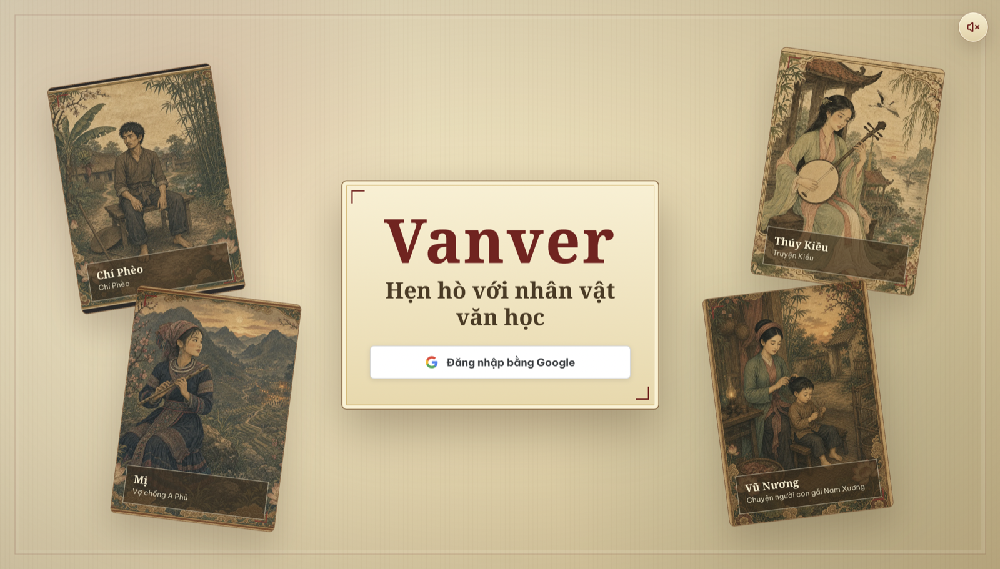
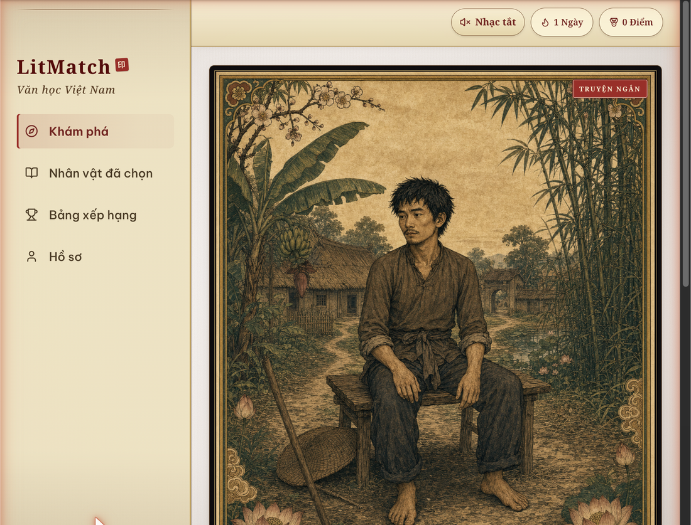
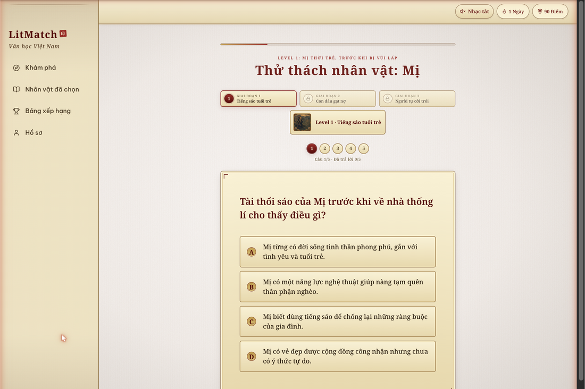
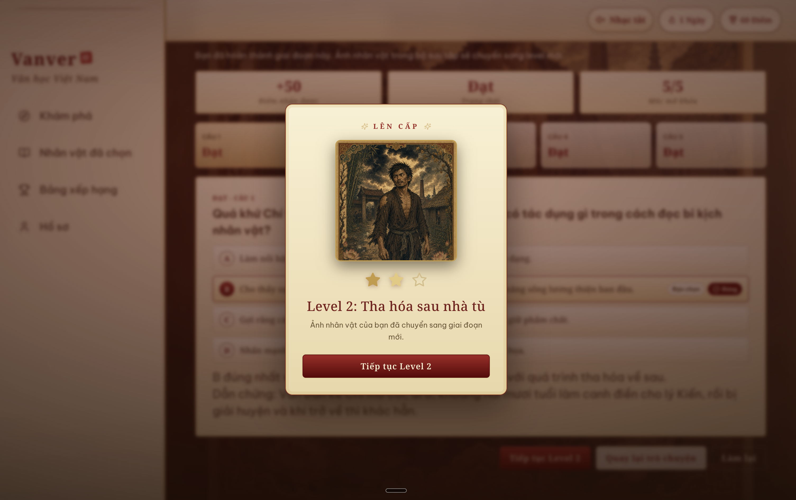

# Vanver
(Vietnamese description below)

> English readers: see [README-en.md](README-en.md).

Bạn gập sách lại. Thở một hơi dài.

Đã hai tiếng trôi qua, nhưng cốt truyện của tác phẩm văn học ngày mai kiểm tra vẫn không chịu chui vào đầu. Phần phân tích nhân vật nghe như được viết bởi một hội đồng người lớn rất mệt mỏi.

Và điều tệ nhất là gì?

Có khi câu chuyện đó *thật sự* hay.Chỉ là nó không còn hay nữa khi bạn bị ép phải học thuộc nó như học thuộc danh sách đi chợ.

Nhưng học văn không nhất thiết phải là một cuộc thi xem ai chịu đựng được bản tóm tắt khô khan nhất. Nếu bạn có thể gặp các nhân vật văn học như những con người thật thì sao? Những con người "bằng da bằng thịt", với đời sống nội tâm phong phú đang chờ bạn khám phá.

Bạn có tò mò hơn về Chí Phèo nếu được trò chuyện với hắn không?  

Bạn có tập trung hơn không nếu việc khám phá nhân vật văn học có cảm giác giống như đang lướt qua các profile?

Thành thật đi. Lướt Tinder thì mắt mở to lắm mà. Văn học cũng xứng đáng có được năng lượng đó.

**Vanver giúp bạn học Văn học Việt Nam như một trò chơi.**  
Thay vì xem nhân vật văn học như bài vở cần thuộc lòng, Vanver biến họ thành những con người bạn có thể khám phá, sưu tầm, trò chuyện và nâng cấp.

Vuốt để gặp các nhân vật văn học, trò chuyện với những nhân vật AI (dựa trên văn bản gốc), và vượt qua thử thách ba giai đoạn để dần mở khóa chiều sâu của từng nhân vật. 

**Mười nhân vật kinh điển đang chờ bạn:**  
Chí Phèo, Mị, Xuân Tóc Đỏ, Lục Vân Tiên, Thúy Kiều, Lão Hạc, Chị Dậu, Ông Sáu, Ông Hai và Vũ Nương.

---

## Trải nghiệm

### 1 · Bắt đầu
Chọn tên hiển thị rồi bước vào hành trình học văn.



### 2 · Khám phá
Vuốt sang phải để thêm nhân vật vào bộ sưu tập và mở khóa phần trò chuyện.



### 3 · Thử thách
Mỗi nhân vật có **ba cấp độ, ứng với 3 giai đoạn** (mỗi giai đoạn gồm 4 câu trắc nghiệm và 1 câu tự luận được chấm theo rubric).



### 4 · Nâng cấp
Nếu hoàn thành được 4/5 câu hỏi thử thách, các bạn sẽ được nâng cấp



> Hoàn thiện vòng trải nghiệm là màn hình **Bộ sưu tập** sắp xếp nhân vật theo
> cấp độ với huy hiệu riêng, phần **Trò chuyện** dựa trên nguồn tư liệu, và
> **Bảng xếp hạng**.

---

## Chạy dự án ở máy local

**Yêu cầu:** Node 18+, Python 3.11+, Docker Desktop, và OpenAI API key.

```sh
# 1. Env — đặt OPENAI_API_KEY trong file .env ở root repo (Vite + backend đều đọc file này)
cp .env.example .env

# 2. Cài dependency frontend
cd frontend && npm install && cd ..

# 3. Cài dependency backend
cd backend && python3 -m venv .venv && ./.venv/bin/pip install -r requirements.txt && cd ..

# 4. Postgres + schema + seed (characters, challenges, demo users)
docker compose up -d postgres          # chờ đến khi `docker compose ps postgres` báo healthy
unset DEBUG                             # backend yêu cầu DEBUG là boolean
cd backend && ./.venv/bin/python scripts/seed_database.py && cd ..

# 5. Knowledge-base embeddings — khôi phục bản pgvector dump đã embed sẵn của team
#    (không tốn OpenAI cost, ~1s): https://drive.google.com/file/d/1cGlRIXH9EOJEwfb22USsUhSV6NCAcq_D/view
bash scripts/restore-knowledge-chunks.sh
```

Sau đó chạy ba tiến trình sau, mỗi tiến trình từ thư mục root của dự án:

```sh
docker compose up -d postgres                                   # database
cd backend && unset DEBUG && ./.venv/bin/python -m uvicorn main:app --reload --port 8081
cd frontend && npm run dev                                      # → http://localhost:5173
```

Frontend có thể chạy **offline ở mock mode**, tức là không cần backend mà vẫn demo được UI.

Trong file `.env` ở root project, biến `VITE_REAL_ENDPOINTS` dùng để chọn endpoint nào sẽ gọi backend thật. Nếu để trống, toàn bộ frontend sẽ dùng dữ liệu mock.

Trạng thái của frontend được lưu trong `localStorage`. Khi cần đưa dữ liệu demo về trạng thái ban đầu, vào **Hồ sơ → Đặt lại dữ liệu thử nghiệm**.

<details>
<summary>Một số lỗi cài đặt thường gặp</summary>

- `npm ERR! enoent`: bạn có thể đang chạy npm sai thư mục. Hãy chạy trong thư mục `frontend/`, hoặc dùng:
  `npm --prefix frontend run dev`.
- `cd: no such file or directory: backend`: có thể bạn đang ở sẵn trong thư mục `backend/`.
- `ConnectionResetError` khi seed dữ liệu: Postgres có thể vẫn đang khởi tạo. Chờ đến khi `docker compose ps postgres` hiển thị `healthy`, rồi chạy lại lệnh seed.
- `DEBUG Input should be a valid boolean`: chạy `unset DEBUG`, hoặc prefix command bằng `env DEBUG=false`.

</details>

---

## Bên trong hệ thống

- **Frontend** — React 18 + TypeScript + Vite, Zustand, TanStack Query, react-tinder-card; dùng Capacitor để đóng gói app cho iOS/Android.
- **Backend** — FastAPI, async SQLAlchemy, Postgres + pgvector, OpenAI GPT-4o + `text-embedding-3-large`; chat dùng SSE streaming.
- **RAG** — mỗi nhân vật có một kho tri thức được tuyển chọn riêng và embed vào `knowledge_chunks`. Chat và phần chấm tự luận sẽ truy xuất bằng chứng thật từ kho này; nếu vector search không khả dụng thì fallback sang lexical search.
